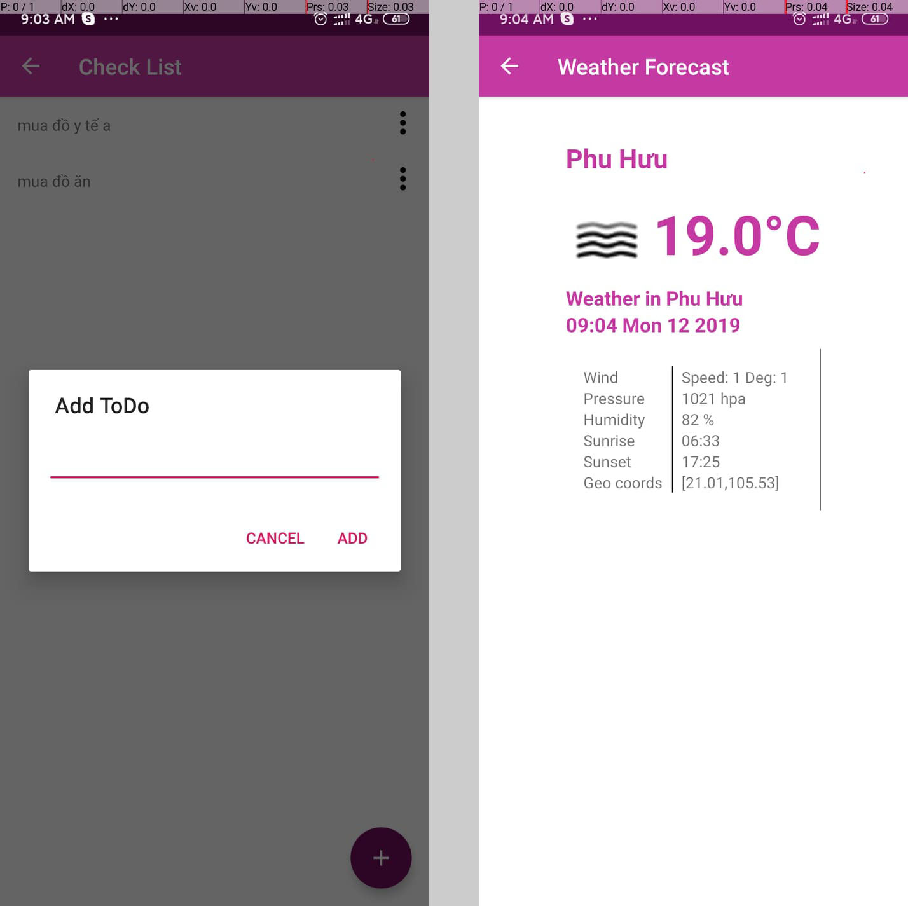
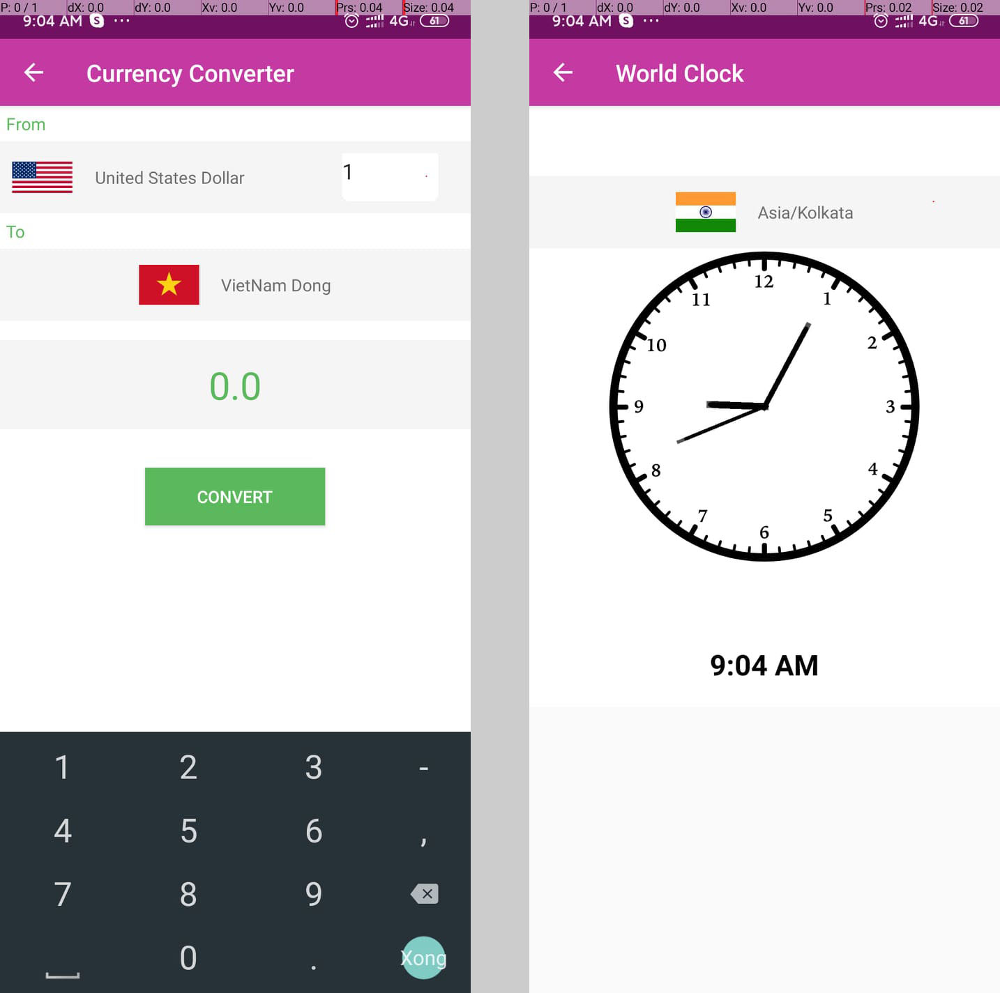

# Trumina | PRM311

## Introduction

“Trumina” is the Mobile Android application about travel, the user has a Checklist to do when
scheduling the trip, Convert Money when moving many countries, Weather for a city, Compass
when u need a direction...

## Some screen UI

### Home screen

### Some feature

### Contribute

[Phạm Ngọc Hòa<Thaycacac>](https://github.com/thaycacac)
[Nguyễn Hải Nam](https://github.com/yeudoi1110)
[Trần Quang Nhật](https://github.com/jetaimefrc)
[Đỗ Quang Hiệp](https://github.com/bacodekiller)
